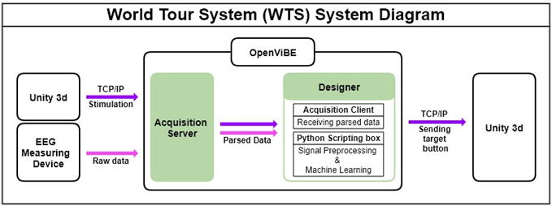
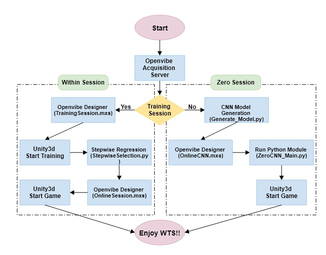

**World Tour System(WTS)**
==========================

**System Overview**
-------------------
### World Tour System (WTS) is a world tour BCI application using P300 brain waves.

### The system is divided into two types depending on the existence of a training session:
* **Within session:** It extracts significant features from user data through training sessions and then trains them to generate LDA classifiers and use it to predict target buttons.
* **Zero session:** It has no training session, and it works by using the CNN model in an online session that predict the target button.

### The following figure is the system diagram of WTS.

### WTS system proceeds as follows.

### See the WTS_Documentation.pdf file for details.
### Or contact me by email: sanghumwoo@gmail.com
